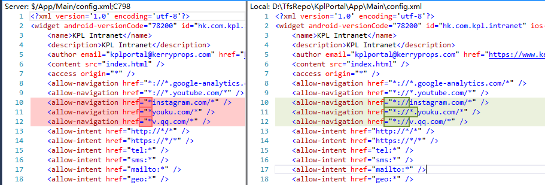

[TOC]

cordova：8.1.1

cordova-ios：4.5.4

## 问题描述

某个changeset（修复问题：ios app中内嵌youtube播放器无法显示）的内容如下：

添加上述修改后，在iOS上点击以下链接，链接没有在safari上打开，什么都不发生：

## 解决方法

config.xml中的内容修改为：

## 问题原因：还没有找到最终的解答

`<allow-intent>`控制app能打开哪些链接。看起来是`<allow-navigation>`中的通配符写法写错了，影响了`<allow-intent>`。

找到这么一个issue： [allow navigation breaks allow intent ? · Issue #499 · apache/cordova-ios](https://github.com/apache/cordova-ios/issues/499)

关于allow-navigation与allow-intent的关系，只在 [apache/cordova-plugin-whitelist: Apache Cordova plugin whitelist](https://github.com/apache/cordova-plugin-whitelist) 中找到这么一句：

>

但是cordova-plugin-whitelist只是给cordova-android用的，不知道这句话是否适用于cordova-ios。

根据 「`<access>` and `<allow-navigation>` to (ATS) 」的结果来看，`<allow-navigation>`中写错通配符，只是少生成了一些ATS条目。

cordova-ios中和`<allow-navigation>` 有关的代码是这个 [cordova-ios/CDVIntentAndNavigationFilter.m at a5e2fbaaa4d3e75e6cf10135569e58826dc29d47 · apache/cordova-ios](https://github.com/apache/cordova-ios/blob/a5e2fbaaa4d3e75e6cf10135569e58826dc29d47/CordovaLib/Classes/Private/Plugins/CDVIntentAndNavigationFilter/CDVIntentAndNavigationFilter.m)，怀疑可能這里面有什么逻辑在`<allow-navigation>`写错通配符时拦截了打开链接操作。

## Cordova Whitelist Guide 

**按顺序**读以下文档：

* [Whitelist Guide - Apache Cordova](https://cordova.apache.org/docs/en/latest/guide/appdev/whitelist/)

* [Whitelist - Apache Cordova](https://cordova.apache.org/docs/en/latest/reference/cordova-plugin-whitelist/)

* [Cordova iOS 4.0.0 - Apache Cordova](https://cordova.apache.org/announcements/2015/12/08/cordova-ios-4.0.0.html)

* [Cordova iOS 4.2.0 - Apache Cordova](https://cordova.apache.org/announcements/2016/06/23/ios-4.2.0.html)

* [top-phonegap-mistakes/the-whitelist-system.md at master · jessemonroy650/top-phonegap-mistakes](https://github.com/jessemonroy650/top-phonegap-mistakes/blob/master/the-whitelist-system.md)

* [Cordova whitelist and Content Security Policy guide - Cordova | Microsoft Docs](https://docs.microsoft.com/en-us/visualstudio/cross-platform/tools-for-cordova/security/whitelists?view=toolsforcordova-2017)

* [Cordova 5 & iOS 9 Security Policy Changes - Modus Create](https://moduscreate.com/blog/cordova-5-ios-9-security-policy-changes/)

**要点：**

1. cordova-plugin-whitelist是给cordova-android用的，cordova-ios不需要
2. config.xml中的`<access>`、`<allow-navigation>`和`<allow-intent>`的用法说明写在cordova-plugin-whitelist的文档中，但它们在cordova-ios上也有用，也要设置。
3. `<access>`: Controls which network requests (images, XHRs, etc) are allowed to be made (via cordova native hooks).Note: We suggest you use a Content Security Policy (see below), which is more secure. This whitelist is mostly historical for webviews which do not support CSP.
4. `<allow-navigation>`: Controls which URLs the WebView itself can be navigated to. Applies to top-level navigations only. By default navigations are only allowed to file:// URLs. To allow others URLs, you must add <allow-navigation> tags to your config.xml. 页面上有iframe，iframe的src能否打开，就是由这个控制的。
5. `<allow-intent>`： Controls which URLs the app is allowed to ask the system to open.
6. Cordova will convert `<access>` and `<allow-navigation>` tags to the appropriate Application Transport Security (ATS) directives which are new in iOS 9.  具体看后文「  `<access>` and `<allow-navigation>`  to  (ATS) 」图。

##  `<access>` and `<allow-navigation>`  to  (ATS) 

转换代码在这里：

打不开链接的：

能打开链接的：

